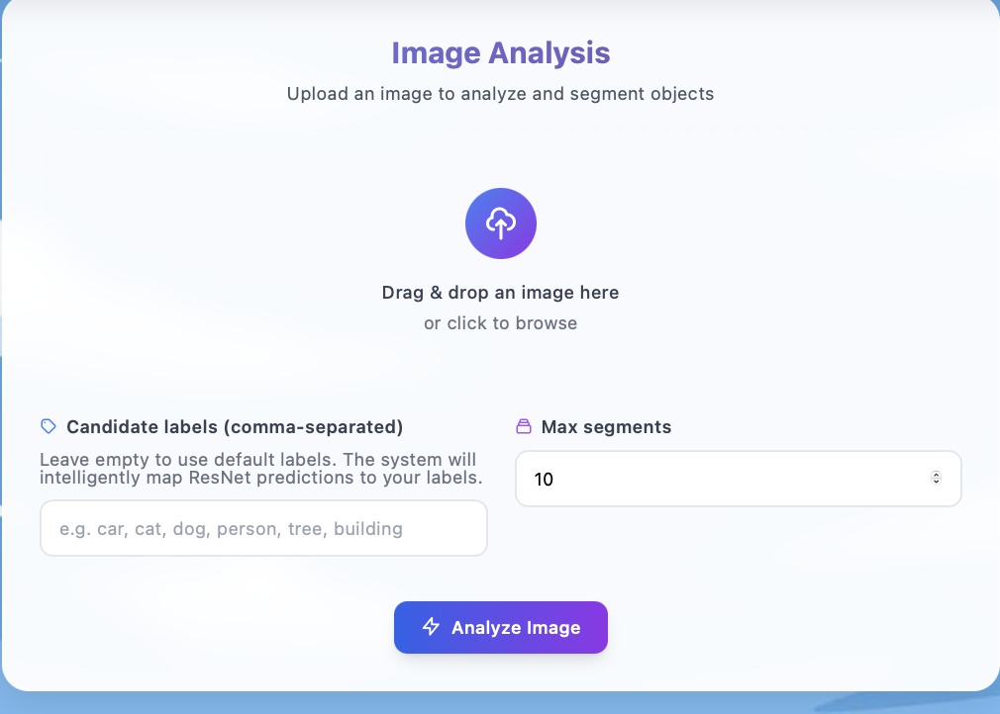

# 🖼️ AI Image Counter

A full-stack web application that uses advanced AI models to count and segment objects in images. Built with FastAPI backend and React frontend.

## ✨ Features

- **Object Detection & Counting**: Automatically detect and count objects in uploaded images
- **Image Segmentation**: Advanced segmentation using SAM (Segment Anything Model)
- **Zero-shot Classification**: Classify objects without training data
- **Modern UI**: Beautiful, responsive React frontend with Tailwind CSS
- **Real-time Processing**: Fast API backend with async processing
- **Multiple AI Models**: Integration with ResNet, SAM, and zero-shot models

## 🏗️ Architecture

```
├── backend/          # FastAPI Python backend
│   ├── app/
│   │   ├── api/      # API routes
│   │   ├── services/ # AI model services
│   │   └── utils/    # Utility functions
│   └── requirements.txt
├── frontend/         # React TypeScript frontend
│   ├── src/
│   │   ├── components/ # React components
│   │   └── api/       # API client
│   └── package.json
└── README.md
```

## 🚀 Quick Start

### Backend Setup

1. **Navigate to backend directory:**
   ```bash
   cd backend
   ```

2. **Create virtual environment:**
   ```bash
   python -m venv venv
   source venv/bin/activate  # On Windows: venv\Scripts\activate
   ```

3. **Install dependencies:**
   ```bash
   pip install -r requirements.txt
   ```

4. **Run the backend:**
   ```bash
   python -m uvicorn app.main:app --reload
   ```

### Frontend Setup

1. **Navigate to frontend directory:**
   ```bash
   cd frontend
   ```

2. **Install dependencies:**
   ```bash
   npm install
   ```

3. **Start development server:**
   ```bash
   npm run dev
   ```

4. **Open your browser:**
   Visit `http://localhost:5173`

## 🖥️ User Interface

Here are screenshots of the AI Image Counter application:

### 🎨 Main Interface

*The main interface showing the image upload and processing capabilities*

### 📊 Results View

*Results view displaying object detection and segmentation results*

## 🛠️ Technologies Used

### Backend
- **FastAPI**: Modern, fast web framework for building APIs
- **PyTorch**: Deep learning framework
- **Transformers**: Hugging Face transformers library
- **SAM**: Meta's Segment Anything Model
- **ResNet**: Deep residual networks for image classification
- **PIL/Pillow**: Python imaging library

### Frontend
- **React 18**: Modern React with hooks
- **TypeScript**: Type-safe JavaScript
- **Tailwind CSS**: Utility-first CSS framework
- **Vite**: Fast build tool and dev server
- **Axios**: HTTP client for API calls

## 🔧 API Endpoints

- `POST /api/upload` - Upload and process images
- `GET /api/health` - Health check endpoint
- `GET /` - Serve the frontend application

## 📊 How It Works

1. **Image Upload**: Users upload images through the web interface
2. **AI Processing**: Backend processes images using multiple AI models:
   - Object detection and counting
   - Image segmentation
   - Zero-shot classification
3. **Results Display**: Frontend displays results with interactive visualizations
4. **Export Options**: Users can download results and segmented images

## 🎯 Use Cases

- **Inventory Management**: Count products in warehouse images
- **Wildlife Monitoring**: Track animal populations in camera trap images
- **Quality Control**: Detect defects in manufacturing images
- **Research**: Analyze images for scientific studies
- **Education**: Learn about computer vision and AI

## 🤝 Contributing

1. Fork the repository
2. Create a feature branch (`git checkout -b feature/amazing-feature`)
3. Commit your changes (`git commit -m 'Add amazing feature'`)
4. Push to the branch (`git push origin feature/amazing-feature`)
5. Open a Pull Request

## 📝 License

This project is licensed under the MIT License - see the [LICENSE](LICENSE) file for details.

## 🙏 Acknowledgments

- Meta AI for the Segment Anything Model (SAM)
- Hugging Face for the transformers library
- The open-source community for amazing tools and libraries

---

**Made with ❤️ by [Chaitanyakota9](https://github.com/Chaitanyakota9)**
